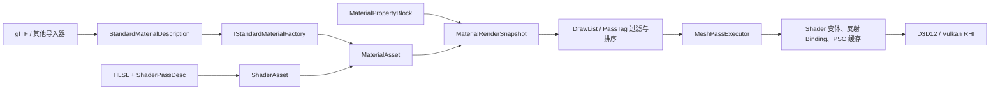

# Shader 与 Material 上层能力

本文总结 RadRay 当前 shader/material 系统向上层应用暴露的能力、典型使用路径、运行时数据流和实现边界。

这里的“上层应用”包括：

- `Application`、`World`、`Actor` 与 `Component` 组成的游戏逻辑层；
- glTF/FBX 等模型导入器；
- 程序化几何、场景查看器和其他需要创建材质的业务代码；
- 自定义渲染管线及自定义 HLSL shader 的实现者。

当前系统整体上对应 Unity 的 `Shader + Material + MaterialPropertyBlock + SRP`：

- `ShaderAsset` 描述一个图形程序、多个 Pass、keyword 和公开 property；
- `MaterialAsset` 引用 shader，并保存参数、keyword、渲染队列和固定功能状态覆盖；
- `MaterialPropertyBlock` 为单个 primitive/section 提供不修改共享材质的参数覆盖；
- `IStandardMaterialFactory` 把与管线无关的标准 PBR 描述翻译为当前管线材质；
- `MeshPassExecutor` 根据 shader 反射自动构建 binding、PSO 并提交绘制。

它已经是一套可用的运行时材质框架，但还不是包含材质编辑器、节点图和资产序列化的完整美术生产系统。

## 总体数据流



上层修改的是 CPU 侧 `MaterialAsset` 或 `MaterialPropertyBlock`。组件在 Tick 中把这些可变对象冻结为不可变的 `MaterialRenderSnapshot`，渲染线程只读取快照，不直接回查和修改原始材质。

## ShaderAsset：图形程序与 Pass 契约

### 多 Pass

一个 `ShaderAsset` 可以持有多个 `ShaderPassDesc`。每个 Pass 可独立声明：

| 元数据 | 上层能力 |
|---|---|
| `PassTag` | 让渲染管线按用途选择 Pass，语义类似 Unity `LightMode` |
| `Source` / `ProgramName` | HLSL 源码与跨进程稳定的预编译产物逻辑名 |
| `VertexEntry` / `PixelEntry` | VS、PS 入口，默认 `VSMain` / `PSMain` |
| `Primitive` | topology、cull、polygon mode 等光栅化基线 |
| `DepthStencil` | 深度/模板格式、比较函数和写入状态 |
| `ColorTargets` | 输出格式、颜色写掩码和混合基线 |
| `MultiSample` | MSAA 状态 |
| `VertexLayouts` | 一个或多个拥有式顶点缓冲布局 |
| `IncludeDirs` | DXC 的 HLSL include 搜索目录 |
| `DynamicBufferBindings` | 需要 dynamic offset 的 cbuffer binding |
| `InterfaceSchema` | 预期 shader 资源接口，用于反射结果校验 |
| `ParameterSources` | 把资源或 cbuffer 字段映射到 Material/Object/View/Pass 数据源 |
| `AllowMaterialRenderStateOverrides` | 是否允许材质覆盖该 Pass 的固定功能状态 |
| `VariantKeywordMask` | 指定该 Pass 实际参与编译的 keyword 位 |

渲染队列通过 `PassTag` 查找 shader Pass：

- 默认颜色 Pass 使用 `UniversalForward`；
- 阴影深度 Pass 使用 `ShadowCaster`；
- shader 没有目标标签时，该 primitive 不进入对应 DrawList。

这使同一个材质可以同时提供颜色绘制、阴影投射或未来其他管线阶段，而不需要上层手工选择入口函数。

相关实现：

- [`ShaderPassDesc`](../modules/runtime/include/radray/runtime/shader_asset.h)
- [`DrawList::AddPrimitive`](../modules/runtime/src/render_framework/render_queue.cpp)
- [`BuildForwardShader`](../modules/runtime/src/render_framework/forward_pipeline_shader.cpp)

### Keyword 与变体

`ShaderKeywordSet` 为 shader 声明有序 keyword 表：

- 最多 64 个 keyword，对应一个 `uint64_t` bitmask；
- keyword 加入顺序就是稳定 bit 位；
- 材质只保存启用的名字，解析 shader 时再投影为 bitmask；
- 未声明的 keyword 会被忽略，不产生变体位；
- 启用位最终变为传给 DXC 的 `NAME=1` 宏；
- `VariantKeywordMask` 可以让每个 Pass 只消费自己的 keyword。

keyword 有两种来源：

| 来源 | 典型用途 |
|---|---|
| `MaterialAsset::EnableKeyword` | 贴图是否存在、alpha test、双面等 per-material 编译分支 |
| `MeshPassExecutor::EnableGlobalKeyword` | 本帧是否存在阴影等由渲染管线决定的全局编译分支 |

解析变体时会合并材质 keyword 与管线全局 keyword，再应用 Pass mask。默认 Forward shader 用 keyword 控制五类贴图、alpha 模式、双面、点光阴影、方向光阴影以及点光 layered shadow caster。

### 编译、反射与缓存

`ShaderAsset::GetOrCreateVariant` 把以下信息提交给 `ShaderVariantLibrary`：

- `ProgramId` 和 Pass 序号；
- keyword bitmask；
- VS/PS 源码及入口；
- include 目录；
- shader model；
- dynamic buffer、push constant 和 interface schema 元数据。

运行时变体 key 包含 program、Pass、backend、keyword、source version、shader model 和编译选项。同一组合只编译一次。

当前编译路径：

| Backend | 字节码 | 反射 |
|---|---|---|
| D3D12 | DXIL | DXC/D3D12 reflection |
| Vulkan | SPIR-V | SPIRV-Cross reflection |

`RenderSystem` 初始化时优先创建 DXC JIT 变体库。DXC 不可用时，回退到 `<exe>/shadercache` 中的预编译字节码与 JSON 反射 sidecar。离线工具 `tools/bake_shaders.py` 和 `radray_shader_baker` 可以生成 DXIL/SPIR-V 产物。

编译产物和后续状态按层缓存：

1. shader stage/module；
2. 完整 shader variant；
3. `PipelineLayout`；
4. 反射生成的 `ShaderBindingPlan`；
5. Graphics PSO；
6. 材质 binding group、常量池切片、sampler 和 texture view。

上层不需要为每个材质或 draw 手工创建 descriptor layout 和 PSO。

相关实现：

- [`ShaderVariantLibrary`](../modules/runtime/include/radray/runtime/shader_variant_library.h)
- [`GraphicsPipelineStateLibrary`](../modules/runtime/include/radray/runtime/pipeline_state_cache.h)
- [`RenderSystem::OnInitialize`](../modules/runtime/src/render_system.cpp)

### 反射驱动的参数来源

每个反射资源、cbuffer 或 cbuffer 字段都可以映射到以下 scope：

| Scope | 生命周期/语义 | 当前典型 provider |
|---|---|---|
| `Material` | 多帧复用，同一材质值共享 | 材质常量、贴图、sampler |
| `Object` | 每个 primitive/draw 不同 | `ObjectToWorld` |
| `View` | 每个相机或视图共享 | `ViewProj`、相机位置、灯光数组 |
| `Pass` | 当前渲染 Pass 共享 | 阴影图、阴影比较 sampler |

`ShaderParameterSourceDesc` 支持两种粒度：

```text
gView                  -> 整个 cbuffer 的来源
gView.CameraPosition   -> cbuffer 内单个字段的来源
```

未显式声明来源的反射参数默认按 Material 处理。反射层会解析 HLSL/SPIR-V cbuffer 的字段名、偏移和大小，把 `MaterialAsset::SetFloat("Field")`、`SetVector("Field")` 等散字段自动打包到正确位置。

`ShaderInterfaceSchema` 还可以校验预期的 group/binding、资源种类、可见 shader stage、dynamic offset 和必需性，避免 HLSL 接口变化后静默绑定到错误位置。

## MaterialAsset：共享材质模板

`MaterialAsset` 引用一个 `ShaderAsset`，保存 property 覆盖、keyword、RenderQueue 和材质侧固定功能状态。它本身不直接拥有 shader module、texture view、sampler、descriptor 或 PSO。

### Property 类型

`MaterialPropertyValue` 当前支持：

| 类型 | 写入 API | 语义 |
|---|---|---|
| `float` | `SetFloat` | 一个反射字段 |
| `Eigen::Vector4f` | `SetVector` | 一个 `float4` 字段 |
| `vector<byte>` | `SetConstantBlock` | 一整个 cbuffer，或自定义字节 property |
| `StreamingAssetRef<TextureAsset>` | `SetTexture` | 纹理默认完整 SRV |
| `TextureSubViewRef` | `SetTexture(texture, subView)` | 指定 mip、array slice 或 format 子视图 |
| `ShaderDefaultTexture` | shader property 默认值 | White/Black linear/sRGB 或 FlatNormal |
| `SamplerDescriptor` | `SetSampler` | 由 `SamplerCache` 去重并创建 sampler |

`ShaderPropertyDesc` 为 shader property 提供名字、类型和可选默认值。默认值主要解决以下问题：

- 材质没有提供贴图时仍能完整写入 descriptor group；
- 新建材质无需重复填充所有数值；
- 绑定时可以校验材质覆盖与 shader property 的类型是否一致。

属性解析优先级固定为：

```text
ShaderPropertyDesc 默认值
        < MaterialAsset property 覆盖
        < MaterialPropertyBlock per-primitive 覆盖
```

对 cbuffer，绑定器先建立清零块并应用 shader 默认值，再依次应用材质层和 PropertyBlock 层。对 texture/sampler，则按相反方向查找第一个存在的覆盖，最终回落到 shader 默认资源。

### RenderQueue 与固定功能状态

`MaterialAsset` 可以设置任意整数 RenderQueue。内置队列与 Unity 语义相近：

| 队列 | 值 | 用途 |
|---|---:|---|
| `Background` | 1000 | 背景 |
| `Geometry` | 2000 | 普通不透明物体 |
| `AlphaTest` | 2450 | alpha clip 材质 |
| `GeometryLast` | 2500 | 不透明阶段末尾 |
| `Transparent` | 3000 | 半透明物体 |
| `Overlay` | 4000 | 覆盖层 |

队列值小于 `Transparent` 的材质进入不透明列表，排序方式是：

```text
RenderQueue 升序 -> MaterialBindingKey 聚合 -> 距离近到远
```

透明材质的排序方式是：

```text
RenderQueue 升序 -> 距离远到近
```

材质可以覆盖以下 PSO 固定状态：

- `CullMode`；
- `DepthWrite`；
- `BlendState`，包括显式开启或显式关闭混合。

其他状态仍取自 `ShaderPassDesc` 的 Pass 基线。`AllowMaterialRenderStateOverrides=false` 的 Pass（例如默认 ShadowCaster 和 error Pass）不接受材质覆盖。

相关实现：

- [`MaterialAsset`](../modules/runtime/include/radray/runtime/material_asset.h)
- [`MaterialRenderState`](../modules/runtime/include/radray/runtime/render_framework/render_pipeline.h)
- [`DrawList`](../modules/runtime/include/radray/runtime/render_framework/render_queue.h)

### MaterialPropertyBlock

`MaterialPropertyBlock` 对应 Unity 的同名机制。它提供与 `MaterialAsset` 相同的常量、纹理和 sampler 覆盖粒度，但只影响一个 `StaticMeshComponent` section：

- 不修改共享 `MaterialAsset`；
- 多个 primitive 可以安全复用同一材质；
- block 可以替换或清除单个 property；
- 每次修改自动递增 version；
- 不能修改 shader、keyword、RenderQueue 或固定功能状态。

典型用法：

```cpp
auto block = make_shared<MaterialPropertyBlock>();
block->SetVector("BaseColor", Eigen::Vector4f{1.0f, 0.2f, 0.1f, 1.0f});
meshComponent->SetPropertyBlock(sectionIndex, std::move(block));
```

如果不同实例需要不同 shader 变体或透明队列，应创建独立 `MaterialAsset`，而不是使用 PropertyBlock。

### 不可变渲染快照

`MaterialAsset` 是游戏线程可修改的共享模板，真正进入 DrawList 的是 `MaterialRenderSnapshot`。

快照冻结以下状态：

- shader 的 streaming 引用；
- 已启用 keyword；
- RenderQueue 和 `MaterialRenderState`；
- 材质常量、纹理引用、纹理子视图和 sampler descriptor；
- 独立的 PropertyBlock 覆盖层；
- 根据所有内容计算的 `MaterialBindingKey`。

`StaticMeshComponent` 为每个 section 记录材质 revision、block version、资产 handle 和解析指针。只有这些数据发生变化时才重建快照。快照通过 `shared_ptr<const MaterialRenderSnapshot>` 发布给 scene proxy，渲染线程无锁只读。

因此，上层可以在下一帧继续修改材质，而当前已提交帧仍持有完整、稳定的旧快照。

相关实现：

- [`MaterialRenderSnapshot`](../modules/runtime/include/radray/runtime/render_framework/material_render_snapshot.h)
- [`StaticMeshComponent::RefreshMaterialSnapshots`](../modules/runtime/src/components/static_mesh_component.cpp)

## 标准前向 PBR 材质

### 与渲染管线解耦的创建入口

模型导入器不直接创建某个具体 shader 的参数表，而是输出 `StandardMaterialDescription` 和纹理表。当前 `RenderPipeline` 通过 `IStandardMaterialFactory` 把中性描述翻译成自己的 `MaterialAsset`。

这给上层带来两个稳定入口：

```cpp
IStandardMaterialFactory* factory = renderSystem->GetStandardMaterialFactory().Get();
StreamingAssetRef<MaterialAsset> material = factory->CreateMaterial(desc, textures);
```

以及：

```cpp
gltfAsset->SpawnScene(world, *factory);
```

后一种路径会为每个 glTF primitive 创建并设置材质；翻译失败时回退到管线默认材质。

### 标准材质参数

`StandardMaterialDescription` 当前提供：

| 类别 | 参数 |
|---|---|
| 基础 PBR | BaseColorFactor、MetallicFactor、RoughnessFactor |
| 基础贴图 | BaseColor、MetallicRoughness |
| 表面细节 | NormalTexture、NormalScale |
| 遮蔽 | OcclusionTexture、OcclusionStrength |
| 自发光 | EmissiveFactor、EmissiveStrength、EmissiveTexture |
| Alpha | Opaque/Mask/Blend、AlphaCutoff |
| 几何面 | DoubleSided |
| Principled 扩展 | Specular、SpecularTint、Clearcoat、ClearcoatGloss、Sheen、SheenTint |

贴图色彩空间约定：

- BaseColor 和 Emissive 以 sRGB 纹理上传；
- MetallicRoughness、Normal 和 Occlusion 以 linear 纹理上传；
- metallic-roughness 贴图遵循 glTF 通道约定：G 为 roughness，B 为 metallic；
- occlusion 使用 R 通道；
- normal map 使用 tangent-space RGB，并由 `NormalScale` 缩放 XY。

默认 shader 始终声明五个 texture binding，并用默认纹理补齐未设置槽位。keyword 只控制是否执行采样代码，不改变材质 descriptor ABI。

### Alpha 和双面语义

| Alpha 模式 | Queue | Shader 行为 | PSO 行为 |
|---|---:|---|---|
| Opaque | Geometry | 输出 alpha 视为 1 | 深度写开、无混合、默认背面剔除 |
| Mask | AlphaTest | 根据 `AlphaCutoff` 执行 `clip` | 深度写开、无混合 |
| Blend | Transparent | 输出 BaseColor alpha | SrcAlpha 混合、深度写关、远到近排序、Cull=None |

`DoubleSided` 会启用 `_DOUBLESIDED_ON`，背面像素会翻转法线，使内壁保持正确受光；非透明双面材质同时覆盖 `Cull=None`。

### Principled 着色

默认 [`forward_pass.hlsl`](../shaderlib/forward_pipeline/forward_pass.hlsl) 使用 [`principled.hlsl`](../shaderlib/principled.hlsl) 中的 Mitsuba3 风格 Principled Reflection，实现：

- metallic/dielectric 混合；
- GGX 各向同性和各向异性高光；
- rough diffuse 与 retro-reflection；
- specular tint；
- sheen 与 sheen tint；
- clearcoat 和 clearcoat gloss；
- flatness 对 diffuse/subsurface 近似项的插值；
- Fresnel 和 eta 参数。

`ForwardMaterialConstants` 还暴露 `anisotropic`、`flatness`、`specTrans` 和 `eta`。标准材质工厂目前只填写 eta 默认值，不从 `StandardMaterialDescription` 暴露其余参数；程序化材质可以直接构造完整常量块。

需要注意，当前入口是 `EvalPrincipledReflection`：`specTrans` 会参与能量分配，但还没有实际的透射、折射或背面 transmission lobe。

### 光照、阴影和输出

默认 ForwardPipeline 支持：

| 能力 | 当前实现 |
|---|---|
| 点光源 | 最多 8 盏，inverse-square 衰减 |
| 方向光 | 最多 8 盏 |
| 点光阴影 | 第一盏开启阴影的点光源，1024x1024 cubemap 六面深度 |
| 方向光阴影 | 第一盏开启阴影的方向光，最多 4 级 CSM |
| CSM 软阴影 | 单 tap、4 tap、5x5 tent 模式 |
| 阴影偏移 | 每级联/每 cube face 基于 texel 世界尺寸的 depth 和 normal bias |
| 输出 | `direct lighting * AO + emissive`，随后 Reinhard tone map 和 linear-to-sRGB |

点光与方向光阴影由管线全局 keyword 控制。本帧没有相应阴影时，shader 变体会完全剔除阴影资源 binding 和采样代码。

## glTF 材质能力

`GltfAsset` 保存 shader 无关的 `GltfMaterialDesc`，其类型就是 `StandardMaterialDescription`。导入器当前映射：

- glTF 2.0 metallic-roughness；
- BaseColor、MetallicRoughness、Normal、Occlusion、Emissive 贴图；
- `alphaMode`、`alphaCutoff` 和 `doubleSided`；
- `KHR_materials_emissive_strength`；
- `KHR_materials_specular` 的 factor，以及对 specular color 的标量近似；
- `KHR_materials_clearcoat` 的 factor/roughness 数值；
- `KHR_materials_sheen` 颜色的标量近似；
- 旧 specular-glossiness workflow 的降级近似：diffuse -> BaseColor，`1-glossiness` -> Roughness，Metallic=0。

几何统一生成或读取 `POSITION/NORMAL/TEXCOORD0/TANGENT`，与默认 Forward shader 的交错顶点布局一致。

示例：

- [`examples/gltf_viewer`](../examples/gltf_viewer/gltf_viewer.cpp)
- [`examples/sphere_demo`](../examples/sphere_demo/sphere_demo.cpp)

## 上层应用的四种使用层级

### 1. 直接加载 glTF

适合模型查看器和一般场景应用：

```cpp
_gltfAsset = LoadGltfAsset(*assets, uploads, path);

if (GltfAsset* asset = _gltfAsset.Get(); asset != nullptr) {
    auto factory = renderSystem->GetStandardMaterialFactory();
    if (factory != nullptr) {
        asset->SpawnScene(world, *factory.Get());
    }
}
```

上层不需要知道 shader、property、keyword 和 Pass 细节。

### 2. 创建程序化标准材质

适合程序化几何、调试场景和业务生成的模型：

```cpp
StandardMaterialDescription desc{};
desc.BaseColorFactor = Eigen::Vector4f{0.82f, 0.67f, 0.34f, 1.0f};
desc.MetallicFactor = 1.0f;
desc.RoughnessFactor = 0.35f;
desc.AlphaMode = StandardAlphaMode::Opaque;

StreamingAssetRef<MaterialAsset> material = factory->CreateMaterial(desc, {});
meshComponent->SetMaterial(sectionIndex, material);
```

### 3. 在实例上覆盖参数

适合大量共享材质、只有少量参数不同的实例：

```cpp
auto block = make_shared<MaterialPropertyBlock>();
block->SetVector("BaseColor", instanceColor);
meshComponent->SetPropertyBlock(sectionIndex, std::move(block));
```

### 4. 创建完全自定义 shader/material

适合自定义渲染效果：

1. 读取 HLSL 源码；
2. 创建 `ShaderKeywordSet`；
3. 为每个阶段构造 `ShaderPassDesc`；
4. 声明 property 默认值和 `ParameterSources`；
5. 通过 `AssetManager::AddReady<ShaderAsset>` 注册 shader；
6. 创建引用该 shader 的 `MaterialAsset`；
7. 设置参数、keyword、RenderQueue 和固定状态；
8. 把材质设置到 `StaticMeshComponent` section。

这条路径允许自定义顶点布局、多个 Pass 和任意兼容的材质字段，但仍受下文通用 Mesh binder 能力限制。

## 失败与异步资源行为

系统区分资源“暂未就绪”和“无效”：

- streaming texture 仍在加载时，binding resolution 返回 `Pending`，当前 draw 暂不提交，后续帧重新解析；
- texture 已失败、property 类型错误、缺失必需 provider 或 shader 接口不兼容时返回 `Invalid`；
- shader 编译、PSO 构建或 binding 无效时，颜色 Pass 尝试使用 error material；
- error shader 只依赖 per-object/per-view 常量，用醒目颜色暴露失败对象；
- 相同 binding diagnostic 会被记录，避免每帧无限重复同一错误。

默认纹理和 sampler 都由长期缓存持有，快照仅保存资产引用或 descriptor 值，避免跨线程、跨帧裸指针悬垂。

## 当前边界与注意事项

### Shader/Binding 边界

- 高层 `ShaderAsset::GetOrCreateVariant` 当前固定构建 VS+PS 图形变体；compute 虽有底层 variant/PSO 基础设施，但没有接入 `MaterialAsset`/`MeshPassExecutor`。
- 通用 Mesh binder 只接受单元素 cbuffer、只读 texture、sampler 和 static sampler。
- 资源数组、bindless、UAV/storage texture、storage/structured buffer、texel buffer、加速结构尚不能通过通用材质 binder 使用。
- `ShaderPassDesc` 可以描述 push constant layout，但通用 Mesh binder 当前会拒绝含 push constant range 的 layout。
- `MaterialAsset::SetFloat/SetVector/SetTexture` 不会立即校验名字和类型；真正的反射匹配和错误报告发生在构建 draw binding 时。

### 默认 ForwardPipeline 边界

- 只有直接点光和方向光，没有 ambient、environment map、IBL、reflection probe 或 sky lighting。
- `light.hlsl` 有 spot light 数据结构和求值函数，但 ForwardPipeline 当前不收集和着色 spot light。
- 点光 `range` 当前用于阴影半径，但颜色求值只采用 inverse-square，并未按 range 截断。
- 只允许第一盏投影点光和第一盏投影方向光产生阴影。
- ShadowCaster Pass 只使用位置、对象矩阵和阴影视图，不采样材质 alpha；Mask/Blend 材质目前会投射完整几何轮廓。
- 当前颜色 DrawList 明确“全收”，还没有视锥裁剪；透明物体按 proxy 原点距离排序，不是逐三角形排序。
- tone mapping 和 sRGB 转换直接发生在材质 pixel shader 内，尚未形成独立 HDR 后处理链。

### 标准材质和 glTF 边界

- 默认 shader 固定消费 `POSITION/NORMAL/TEXCOORD0/TANGENT`，不支持 skinning、morph target 或其他顶点流。
- 所有五类材质贴图共用一个 sampler。
- glTF 当前只读取 UV0，没有纹理 UV 集选择和 `KHR_texture_transform`。
- specular、clearcoat、sheen 扩展只映射数值近似，没有映射对应扩展贴图。
- transmission、volume、IOR、iridescence、anisotropy 等 glTF 扩展尚未进入标准材质描述。

### 资产与工具链边界

- 当前没有 `.shader`/`.material` 文件格式或对应资产反序列化 loader。
- 没有材质 Inspector、节点图、MaterialInstance 继承或运行时 property 枚举 UI。
- `ShaderVariantKey` 预留了 `SourceVersion`，但 `ShaderAsset` 当前未接入源码版本更新和完整 hot reload。
- 离线 shader bake 机制已实现，但仓库当前未提供工具默认引用的 `assets/shader_variants/forward_pipeline.json` 变体集合，需要部署方补齐。
- RHI 枚举包含 Metal，且 render 模块有 MSL/SPIRV-Cross 工具代码；当前 runtime variant 来源和示例实际打通的是 D3D12/DXIL 与 Vulkan/SPIR-V，不应把默认材质路径视为已支持 Metal。

### 当前代码契约不一致

编写自定义材质 shader 时应特别注意两处现状：

1. [`shaderlib/material.hlsl`](../shaderlib/material.hlsl) 仍描述旧的 `space0=View、space1=Material、push constant=Object` 约定；当前通用 Forward shader 使用 `space0=Object、space1=View/Pass、space2=Material`，并且通用 Mesh binder 不支持 push constant。新 shader 应以 [`forward_pass.hlsl`](../shaderlib/forward_pipeline/forward_pass.hlsl)、`ShaderParameterSourceDesc` 和实际反射 binding 为准。
2. `MaterialAsset::SetConstantBlock` 头文件注释称超出 cbuffer 的数据会被截断，但当前 binding resolver 会把“输入字节数大于目标块”判定为无效。调用方应传入不大于反射块大小的数据，最好保持精确匹配。

## 能力结论

当前 shader/material 系统已经可以稳定支撑：

- 程序化网格和多 section 材质；
- glTF metallic-roughness 场景导入；
- 标准 PBR、五类贴图、alpha test/alpha blend 和双面材质；
- 材质 keyword 与管线全局 keyword 组合；
- 点光、方向光、点光 cubemap 阴影和方向光 CSM；
- 共享材质加 per-instance property 覆盖；
- 反射驱动的 Object/View/Pass/Material 参数绑定；
- D3D12/Vulkan 运行时编译、预编译 fallback 与多层缓存；
- 游戏线程修改、渲染线程无锁读取的不可变材质快照。

对于上层应用，它提供的核心价值不是单一 PBR shader，而是把“导入器材质描述、shader 变体、参数绑定、渲染状态、资源生命周期和 draw 提交”连接成了一条可复用的运行时路径。

