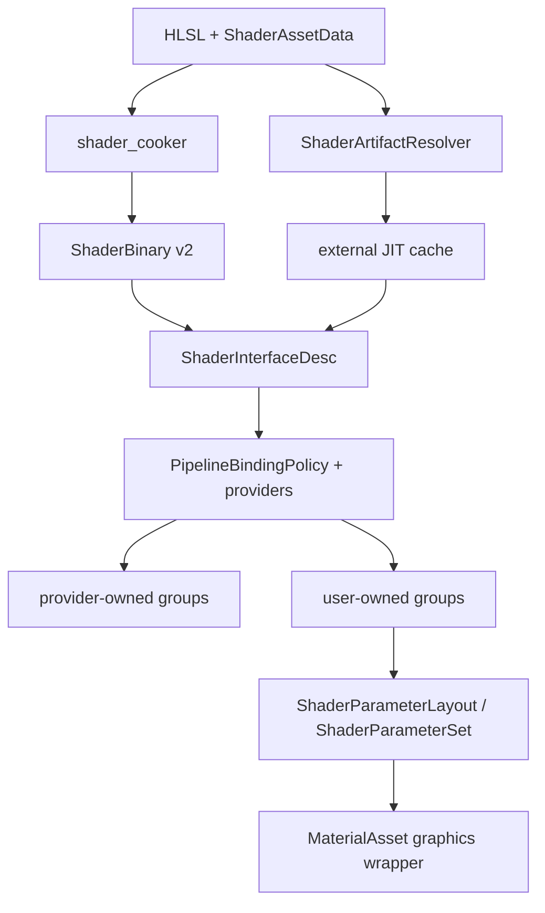

# Shader 与 Material CPU 契约

本文描述 RadRay 当前已经实现的 shader/material CPU-side 契约，以及进入 GPU binding、PSO 和 draw 链路前的明确边界。

当前阶段只支持 VS、PS、CS。目标不是创建可执行渲染链路，而是保证离线 cooking 与运行时 JIT 都能产生同一套后端无关接口，并把 pipeline-owned 与 user-owned 参数可靠分开。

## 总体结构



三个边界必须保持独立：

- `ShaderInterfaceDesc` 只描述一个具体 Pass + Variant 的物理/反射接口；
- `PipelineBindingPolicy` 只描述当前 pipeline 独占哪些 group，以及对应 provider 是否支持实际接口；
- `ShaderParameterSet` 只保存剩余 user-owned groups 的 CPU 参数值。

这些类型不持有 `PipelineLayout`、`BindingGroup`、descriptor、PSO 或 draw 状态。

## Canonical Shader Interface

[`ShaderInterfaceDesc`](../modules/shader/include/radray/shader/shader_interface.h) 是一个完整 program interface：

- graphics 由 VS 与可选 PS 的 `ShaderStageInterfaceDesc` 合并；
- compute 由 CS stage interface 构建；
- binding 按 `(groupIndex, bindingIndex)` 标识；
- cbuffer/structured buffer 保留字段、嵌套成员、offset、size、array stride、matrix stride 和 matrix major；
- texture 保留 dimension、sample type、array/multisample/depth 信息；
- buffer 保留 kind、element stride 和 read/write access；
- graphics 保留 vertex input、inter-stage IO 和 pixel output；
- compute 保留 thread-group size；
- push constant range 可被表示和哈希，但当前不进入通用 `ShaderParameterSet`。

DXIL reflection 和 SPIR-V reflection 都先归一化，再参与 program merge。cooker 在同时生成两个 target 时要求同一 Pass + Variant 的 canonical interface 完全一致，否则拒绝输出。

当前已经处理的跨后端差异包括：

- DXIL 未使用 signature input；
- SPIR-V inactive resource；
- backend 生成的 IO 名称与 builtin location；
- HLSL/SPIR-V matrix major 差异；
- struct array 的 element stride 与成员范围；
- raw、structured、typed buffer 和 storage resource 分类。

接口比较明确分成三种关系：

- `operator==` / `HashShaderInterface` 是严格 identity，包含用户可见名称；
- `AreShaderBindingsAbiCompatible` 是对称的物理 ABI 等价，忽略名称和 stage visibility；
- `IsShaderBindingAbiProjectionOf(actual, complete)` 是有方向的投影关系。

非 cbuffer 资源的投影仍要求严格物理 ABI。cbuffer 的 actual interface 可以只保留 complete layout 中 offset、size 和 type 一致的 leaf fields，并使用不大于 complete 的 `ByteSize`，从而兼容 DCE。provider schema 与 Material program completeness 共用这一个投影原语。系统没有额外的 Pipeline ABI 版本号。

## VariantDomain、BakeSet 与 ShaderBinary v2

[`ShaderPassDesc`](../modules/shader/include/radray/shader/shader_asset_data.h) 将两个概念分开：

- `ShaderVariantDomain`：keyword group 定义哪些完整组合合法；
- `ShaderBakeSet`：指定离线实际预编译哪些合法组合。

`BakeSet` 可以稀疏，甚至为空。JIT 请求只需要属于 `VariantDomain`，不要求已经 baked。

keyword 会按 stage 投影。比如一个 pixel-only keyword 不进入 VS artifact key，因此多个完整 program variant 可以复用同一个 VS bytecode。

[`ShaderBinary`](../modules/shader/include/radray/shader/shader_binary.h) 包含以下去重表：

1. raw reflection table；
2. canonical stage-interface table；
3. canonical program-interface table；
4. target-specific stage artifact table；
5. full variant 到 stage artifacts/program interface 的 mapping table。

`ShaderBinary::IsValid()` 只检查结构、索引、hash、reflection/interface 一致性和跨 target canonical 一致性，不要求所有 target/variant 存在。发布覆盖率由 `IsBakeComplete(target)` 单独检查。

binary format 当前为 v2，不读取旧 v1 文件。writer 会排序和重映射所有 table index，保证同一逻辑内容确定性输出；reader 会拒绝损坏、悬空索引、重复 record 和非 canonical 排序。

## Pipeline Provider 规则

[`PipelineBindingPolicy`](../modules/runtime/include/radray/runtime/shader_parameters.h) 以整个 group 为所有权单位。解析规则固定为：

```text
reserved group 未出现在 shader 中         合法，跳过
reserved group 出现且 provider 完全支持   provider-owned
reserved group 出现未知/冲突 binding      不兼容
非 reserved group                         user-owned
```

provider 不会向 shader 注入未声明 binding，也不暴露 `Pipeline/View/Pass/Object` scope。一个 provider 可以允许 shader 只声明其支持 binding 的子集，并可显式列出同一位置的多个合法 ABI 投影；但只要实际 group 中出现 provider 不认识或物理布局不兼容的 binding，整组解析失败。失败 diagnostic 会携带 provider、group 和 binding。

自定义 shader 可以完全不声明 pipeline 参数。使用空 policy 时，所有 binding groups 都是 user-owned。

默认 Forward policy 当前保留：

- group 0：object provider；
- group 1：Forward pipeline provider；
- group 2 只是 Forward shader 的材质约定，不是系统级特殊 group，因未被 policy 保留而属于用户参数。

## User Parameter Layout

[`ShaderParameterLayout`](../modules/runtime/include/radray/runtime/shader_parameters.h) 对所有目标 Pass/Variant 的 user-owned bindings 建立兼容并集。

稳定规则以 binding 为单位：

- 某个 pass/variant 可以完全不使用一个 group 或一个 binding；
- 同一 `(group,binding)` 一旦在多个接口中出现，名称与物理 ABI 必须兼容；
- stage visibility 可以取并集；
- 同名不同 location、同 location 不同类型、不同 array/resource shape 都会失败。

同一 cbuffer 在不同 variant 中可以只反射不同字段。layout 会将嵌套字段展开为稳定路径后形成无冲突并集：同名字段必须保持相同 offset/type/size，不同名称的字段不能占用重叠字节，最终 `ByteSize` 取所有投影的最大值。字段和 binding 均按稳定顺序排列，因此 layout hash 不依赖 baked/JIT interface 的到达顺序。显式 property alias 留给未来作者元数据，不能由相同 offset 自动推断。

采用 binding 级并集是必要的：keyword 分支经过 DCE 后，即使 HLSL 始终声明资源，不同 variant 的 reflection 仍可能只包含实际使用的 binding。Material 保存稳定超集，具体 program interface 仍保留每个 variant 的实际投影。

字符串 API 只在名称唯一时成功。`ShaderParameterSet` 与 `MaterialAsset` 都提供 `ShaderParameterLocation{group,binding}` 加字段名的精确 setter；多 user group 出现同名 binding/field 时不会静默选错目标，也不会迫使调用方绕过 Material revision。

[`ShaderParameterSet`](../modules/runtime/include/radray/runtime/shader_parameters.h) 当前支持：

- bool/int/uint/float scalar 与任意反射 vector 宽度；
- float matrix，按 matrix stride/major 正确打包；
- constant array 与完整 cbuffer 写入；
- sampled/storage texture；
- sampler 与固定/不定长 resource array；
- typed/structured/raw buffer；
- 多个 user-owned group。

错误 scalar type、vector width、matrix shape、resource kind、array index、texture dimension/format/usage、buffer usage、range 或 structured stride 会在 setter 调用或完整性检查时被拒绝。

默认状态为：

- constant buffer 清零；
- sampler 初始化为默认 `SamplerDescriptor`；
- 固定大小的 texture/buffer/storage resource 未设置时，全 layout 的 `IsComplete()` 为 false；
- unbounded resource array 可以为空。

`IsCompleteFor(ResolvedShaderBindingPlan)` 只检查一个具体 program 实际使用的 user-owned bindings。某个资源只存在于未启用的 keyword variant 时，不会阻止当前 program 使用 Material；切换到声明该资源的 variant 后，未设置值会立即变成不完整。

layout 因新 JIT variant 扩展时，cbuffer 会复制已有字节并将新增尾部清零；resource 只在严格兼容时迁移。push constant 与 acceleration structure 当前不属于通用 ParameterSet，layout 构建会显式返回 unsupported diagnostic，不会静默忽略。

资产作者默认值、默认 white/black/normal texture 和 property alias 尚未进入当前数据模型，不能从 reflection 推断。这些应作为未来 `ShaderPropertyDesc` 作者元数据实现，不能塞入 `ShaderInterfaceDesc`。

## MaterialAsset

[`MaterialAsset`](../modules/runtime/include/radray/runtime/material_asset.h) 是 graphics-only 的轻量包装：

- 持有不可变 `ShaderAsset` 引用；
- 持有 pipeline binding policy；
- 持有 local keyword 状态；
- 持有一个 multi-group `ShaderParameterSet`。

Material 不再接受单个裸 `bindingGroup`。layout 在 ShaderAsset/policy 改变时解析一次，参数 mutation 不会重新扫描 binary 或 backend reflection。

provider-owned 参数不会出现在 Material setter 可见范围内。compute shader 不使用 `MaterialAsset`，直接构造 `ShaderParameterSet`。

`MaterialAsset::IsReady()` 只表示 Shader 与 CPU layout 结构就绪；具体 program 的缺失资源由 `HasCompleteParametersFor()` 判断。

JIT program 到达后，`ApplyResolvedPrograms` 会先验证 source/program identity 是否属于当前 ShaderAsset，再按 `(pass, full defines)` 累积 target-independent canonical interface，并与全部 baked/JIT interfaces 一起构建 layout。兼容扩展会迁移已有 binding 值；同一 program 的跨 target interface 不一致或 user layout 冲突会返回带双方上下文的 diagnostic，并原子保留旧 interface 集合、layout 和 values。原始 interface 注入只是 Material 内部事务 helper，不是可绕过 provenance 的公共入口。

## 不可变 ShaderAsset 与 JIT

[`ShaderArtifactResolver`](../modules/runtime/include/radray/runtime/shader_asset.h) 是 `ShaderAsset` 外部的 artifact resolver。查找顺序为：

1. ShaderAsset baked program；
2. memory program cache；
3. disk JIT cache；
4. async JIT compile。

resolver 不写回 `ShaderAsset`。结果由 `ShaderResolvedProgram` 独立拥有 bytecode、raw reflection、stage interfaces 和 program interface。

JIT program key 包含：

- source + transitive literal include content hash；
- pass、target 和 full defines；
- entry point、shader model、optimize/unbounded options；
- DXC toolchain hash；
- RadRay JIT/canonicalization schema identity。

stage cache 使用 stage-projected defines，因此不同 full variant 可以共享 VS/PS/CS 编译结果。相同并发请求共享 `shared_future`；失败结果也进入 memory cache，避免每帧重试。

source graph scanner 递归处理字面量 `#include "..."` / `#include <...>`，并保守包含条件分支中的 include。宏展开 include 当前会被拒绝，因为无法在编译前可靠计算传递内容身份。

shader cooker 会为每个 Pass 计算并持久化 source identity。存在 baked program 的 Pass 必须携带这个 identity，JIT miss 才能证明实时源码与 baked artifact 来自同一快照。完全没有 baked program 的 JIT-only manifest 可以在第一次请求时为 `(AssetHandle, pass index)` 惰性封存 identity；这类 ShaderAsset 必须已经发布到 resolver 绑定的 `AssetManager`：

- 源文件未变化时继续使用同一 cache identity；
- 源文件变化后，旧 ShaderAsset 仍可返回已有 memory/disk artifact；
- 旧对象不能为新的 miss 编译变化后的源码；
- hot reload 必须通过新的 AssetManager slot 发布不可变 ShaderAsset，新 generation handle 获得新的 source identity。

已有 pass identity 时，resolver 会先按捕获值查询 memory/disk cache，再读取当前 source graph。因而旧资产的已有 artifact 不依赖源码继续存在；只有真正的 cache miss 才要求实时源码可用且仍与该不可变对象的捕获身份一致。不同 Pass 的源码身份互不覆盖，resolver 在访问 source snapshot 表时会移除 AssetManager 已判定失效的 generation handle。

每个 resolved program 还携带由 source identity、pass index、完整 defines、entry point、shader model 和编译选项计算出的稳定 program identity。Material 会重新计算并验证它，因此另一份不同源码或不同 Pass 配置的结果不能扩展当前 layout；内容完全等价的资产仍可共享 artifact cache。

如果同一 source/pass/variant 的 DXIL 与 SPIR-V JIT 结果 canonical interface 不同，resolver 会拒绝后到结果。若另一 target 已 baked，JIT 结果也必须与 baked interface 一致。

`RenderSystem` 在启用 `RADRAY_ENABLE_SHADER_JIT` 时创建 DXC compiler 与 resolver。resolver 会重新从 compiler 返回的 raw reflection 构建 stage interface，并验证 target、stage、entry、projected defines 和 bytecode hash。JIT cache 文件复用 ShaderBinary v2 的完整校验与原子写入，同时嵌入并验证完整 program cache key；路径命中本身不被视为可信来源证明。

## Diagnostic

normalization、merge、provider、parameter layout 和 JIT failure 都携带结构化上下文：

- target；
- pass index；
- full variant defines；
- stage；
- group/binding（适用时）；
- provider name（provider failure）。

跨 pass/variant 的 user layout 冲突同时保存当前与原始 `ShaderDiagnosticContext`，调用方可以定位冲突双方，而不是只得到 group 级错误。

调用方不应把 `false/nullopt` 当作唯一错误信息；cooker 和 runtime result 都保留可定位原因。

## 本阶段验收矩阵

| 契约 | 直接测试证据 |
| --- | --- |
| DXIL/SPIR-V canonical graphics、compute interface 一致 | `ShaderInterfaceTest.DxilAndSpirvProduceEquivalent*` |
| VariantDomain/BakeSet 分离、稀疏 binary、确定性序列化与损坏拒绝 | `ShaderBinaryTest`、`ShaderCookerTest` |
| reserved group 缺失合法、未知 binding 拒绝、provider cbuffer projection | `ShaderBindingPolicyTest` |
| 多 user group、类型安全 setter、资源完整性与实际 program projection | `ShaderParameterLayoutTest`、`ShaderParameterSetTest` |
| cbuffer 字段并集、冲突双方诊断、layout 扩展保值 | `ShaderParameterLayoutTest.UnionsConstantBufferFieldProjectionsDeterministically`、`ShaderParameterSetTest.ConstantProjectionCompletenessAndLayoutGrowthPreserveValues` |
| baked/memory/disk/JIT、请求合并、negative cache、source snapshot 与 cache provenance | `ShaderArtifactResolverTest` |
| 真实 cooker 的 Forward/Shadow、多 target/variant 和 cbuffer field projection | `ForwardMaterialCookerTest` |

## 当前明确延期

本阶段没有实现以下能力：

- 从 canonical interface 创建 RHI `PipelineLayout`；
- descriptor/constant upload；
- GPU material cache 与跨帧回收；
- PSO 构建、draw/dispatch 提交；
- `BindingGroupLayout` 独立 identity；
- push constant 的通用 user parameter 路径；
- asset-authored property default/alias、material 文件和编辑器；
- geometry/tessellation/ray-tracing shader stage。

不要让上述 GPU 生命周期或 PSO 状态反向进入当前 CPU 数据模型。

## 后续迭代顺序

1. **作者元数据**：增加 `ShaderPropertyDesc`、默认资源、required/optional 策略、material serialization 和 hot-reload value migration；这些仍是 CPU/asset 能力。
2. **BindingGroupLayout identity**：把 `BindingGroup` 从完整 `PipelineLayout` 指针解耦，binding 时按目标 group layout identity 校验。
3. **GPU parameter projection**：依据具体 `ShaderInterfaceDesc`，从 ParameterSet 超集投影当前 program 实际使用 bindings。
4. **material GPU cache**：以 parameter-layout hash、resource revisions 和 flight/fence 生命周期缓存 descriptor 与 constant upload。
5. **pipeline/PSO integration**：canonical program interface 驱动 layout，bytecode artifact 驱动 shader module/PSO；provider 与 user groups 在 encoder 前汇合。

进入第 2 步前，不应继续扩展旧的完整 `PipelineLayout*` 绑定组复用方式。
