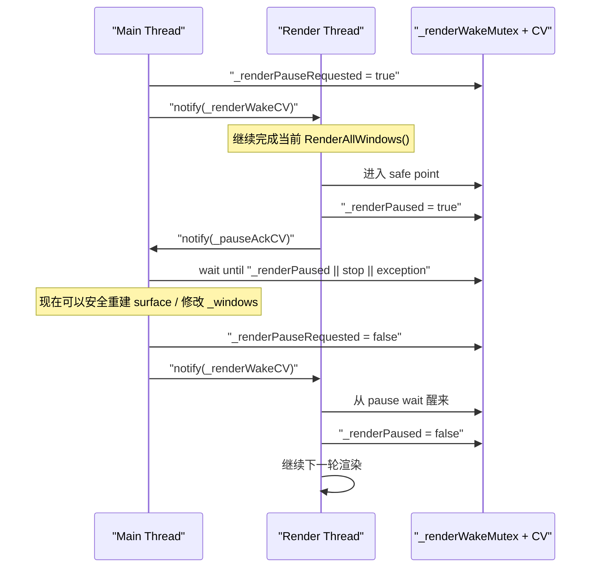
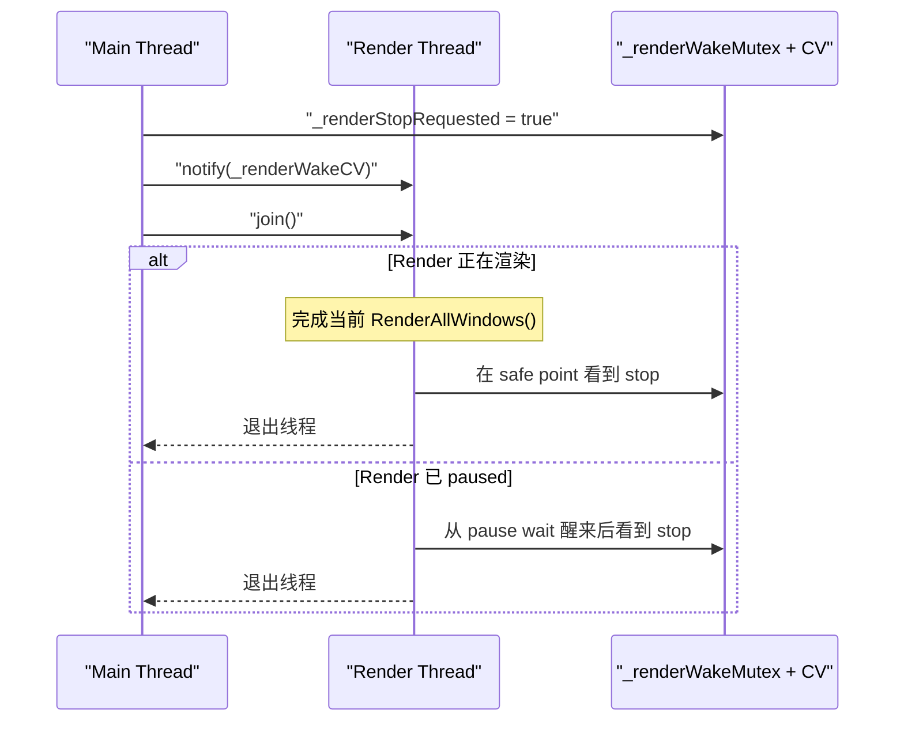

推荐这一版就把“线程控制”单独做成一个同步域：所有 pause/resume/stop/exception/new-frame 状态都由同一把 mutex 和两组 CV 管，不和 `_renderMutex` 混用。这样 safe point 语义最清楚，也不会踩到 `atomic + cv` 混用的 lost wakeup 坑。

safe point 我建议固定定义为：render thread 只在 `RenderAllWindows()` 完整返回后的外层循环顶端响应 `Pause/Stop`。也就是说，一旦 `PauseRenderThread()` 返回，主线程就可以安全做 swapchain 重建、`_windows` 拓扑修改，因为此时 render thread 不会再持有 `GpuFrameContext`、窗口引用或 mailbox 的中间态。

**状态**
这些成员适合放进 [application.h](</C:/Users/xiaoxs/Desktop/RadRay/modules/runtime/include/radray/runtime/application.h>)：

```cpp
#include <condition_variable>

class Application {
protected:
    void RenderThreadMain();
    void NotifyNewFrame();
    void PauseRenderThread();
    void ResumeRenderThread();
    void StopRenderThread();
    void CheckRenderThreadException();

    template <class F>
    decltype(auto) WithRenderThreadPaused(F&& fn);

protected:
    std::mutex _renderWakeMutex;
    std::condition_variable _renderWakeCV;
    std::condition_variable _pauseAckCV;

    bool _newFramePending{false};
    bool _renderPauseRequested{false};
    bool _renderPaused{false};
    bool _renderStopRequested{false};
    std::exception_ptr _renderThreadException{};

    std::thread _renderThread;
};
```

这里我建议这些控制变量都用普通 `bool`，不要用 atomic。因为它们全都在 `_renderWakeMutex` 保护下，语义更统一。

**实现**
这些实现放进 [application.cpp](</C:/Users/xiaoxs/Desktop/RadRay/modules/runtime/src/application.cpp>) 比较合适：

```cpp
void Application::NotifyNewFrame() {
    {
        std::lock_guard lock{_renderWakeMutex};
        _newFramePending = true;
    }
    _renderWakeCV.notify_one();
}

void Application::PauseRenderThread() {
    {
        std::lock_guard lock{_renderWakeMutex};
        if (!_renderThread.joinable()) {
            return;
        }
        if (_renderPaused || _renderPauseRequested) {
            return;
        }
        if (_renderStopRequested || _renderThreadException != nullptr) {
            return;
        }
        _renderPauseRequested = true;
    }

    _renderWakeCV.notify_one();

    std::unique_lock lock{_renderWakeMutex};
    _pauseAckCV.wait(lock, [this]() {
        return _renderPaused || _renderStopRequested || _renderThreadException != nullptr;
    });
}

void Application::ResumeRenderThread() {
    {
        std::lock_guard lock{_renderWakeMutex};
        if (!_renderThread.joinable()) {
            return;
        }
        if (_renderStopRequested) {
            return;
        }
        _renderPauseRequested = false;
    }
    _renderWakeCV.notify_one();
}

void Application::StopRenderThread() {
    {
        std::lock_guard lock{_renderWakeMutex};
        if (!_renderThread.joinable()) {
            return;
        }
        _renderStopRequested = true;
        _renderPauseRequested = false;
    }

    _pauseAckCV.notify_all();
    _renderWakeCV.notify_one();

    if (_renderThread.joinable()) {
        _renderThread.join();
    }
}

void Application::CheckRenderThreadException() {
    std::exception_ptr ex{};
    {
        std::lock_guard lock{_renderWakeMutex};
        ex = std::exchange(_renderThreadException, nullptr);
    }

    if (ex == nullptr) {
        return;
    }

    if (_renderThread.joinable()) {
        _renderThread.join();
    }
    _multiThreaded = false;
    std::rethrow_exception(ex);
}

void Application::ReportRenderThreadException(std::exception_ptr ex) {
    {
        std::lock_guard lock{_renderWakeMutex};
        if (_renderThreadException == nullptr) {
            _renderThreadException = ex;
        }
        _renderStopRequested = true;
    }

    _pauseAckCV.notify_all();
    _renderWakeCV.notify_one();
}

void Application::RenderThreadMain() {
    try {
        while (true) {
            {
                std::unique_lock lock{_renderWakeMutex};
                _renderWakeCV.wait_for(lock, std::chrono::milliseconds(16), [this]() {
                    return _newFramePending || _renderPauseRequested || _renderStopRequested;
                });

                if (_renderStopRequested) {
                    return;
                }

                if (_renderPauseRequested) {
                    _renderPaused = true;
                    lock.unlock();
                    _pauseAckCV.notify_all();

                    lock.lock();
                    _renderWakeCV.wait(lock, [this]() {
                        return !_renderPauseRequested || _renderStopRequested;
                    });

                    _renderPaused = false;
                    if (_renderStopRequested) {
                        return;
                    }
                    continue;
                }

                _newFramePending = false;
            }

            // safe point 之后开始一整轮渲染；
            // 约定：RenderAllWindows 返回时，不再持有任何 frameContext / window 引用 / mailbox 中间态。
            this->RenderAllWindows();
        }
    } catch (...) {
        this->ReportRenderThreadException(std::current_exception());
    }
}
```

这里有两个实现细节值得保留：

- `ResumeRenderThread()` 不直接改 `_renderPaused`。`_renderPaused` 由 render thread 自己在进入/离开 pause 态时维护，状态归属更清楚。
- `wait_for(16ms)` 是为了在没有新帧通知时也能周期性做一轮 `RenderAllWindows()`，把 completed flight 回收掉，避免所有 slot 占满后主线程 prepare 自阻塞。以后如果你补了更明确的 completion wakeup，也可以改回纯 `wait()`。

**Pause Helper**
`HandleSurfaceChanges()` 或运行时 `CreateWindow()` 建议统一走这个 helper：

```cpp
template <class F>
decltype(auto) Application::WithRenderThreadPaused(F&& fn) {
    bool needPause = false;
    {
        std::lock_guard lock{_renderWakeMutex};
        needPause = _multiThreaded && _renderThread.joinable() && !_renderPaused;
    }

    if (needPause) {
        this->PauseRenderThread();
        this->CheckRenderThreadException();
    }

    if constexpr (std::is_void_v<std::invoke_result_t<F&&>>) {
        std::invoke(std::forward<F>(fn));
        if (needPause) {
            this->ResumeRenderThread();
        }
    } else {
        decltype(auto) result = std::invoke(std::forward<F>(fn));
        if (needPause) {
            this->ResumeRenderThread();
        }
        return result;
    }
}
```

这个 helper 的关键点还是老原则：只在成功路径 resume；`fn()` 抛异常时故意保持 render thread 停住，让 `Run()` 顶层 catch 去 `stop/join` 收口。

**时序图**
暂停与继续：



停止线程：



如果你愿意，我下一步可以直接把这版再收成一份“贴到当前 `application.h/.cpp` 就能继续改”的最小补丁清单，把 `ApplyPendingThreadMode()` 的启动/关闭路径也一起补上。